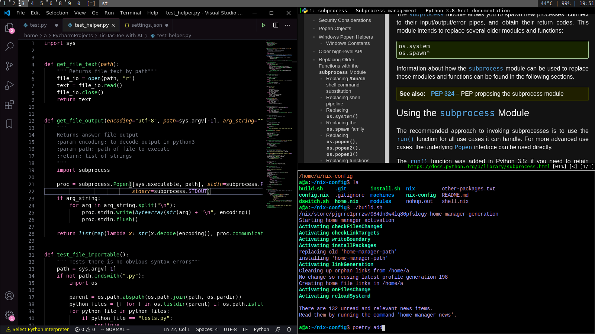

# Building my dotfile configurations with Nix



## Supported Systems

- Linux running systemd, with SELinux disabled
- macOS

## Installation

```sh
sh <(curl -L https://nixos.org/nix/install) --daemon  # Install Nix
git clone https://github.com/aith/my-nix-dotfiles.git $HOME/nix-config  # Clone this
cd $HOME/nix-config
bash install.sh { generic, sun } # Choose machine. I don't recommend using sun.
bash build.sh    # Build from configurations
```

## Customization

To change which modules are included in the build, edit the variables under 'customizeable'
in the machine you chose.

To rebuild, use

```sh
bash build.sh
```
